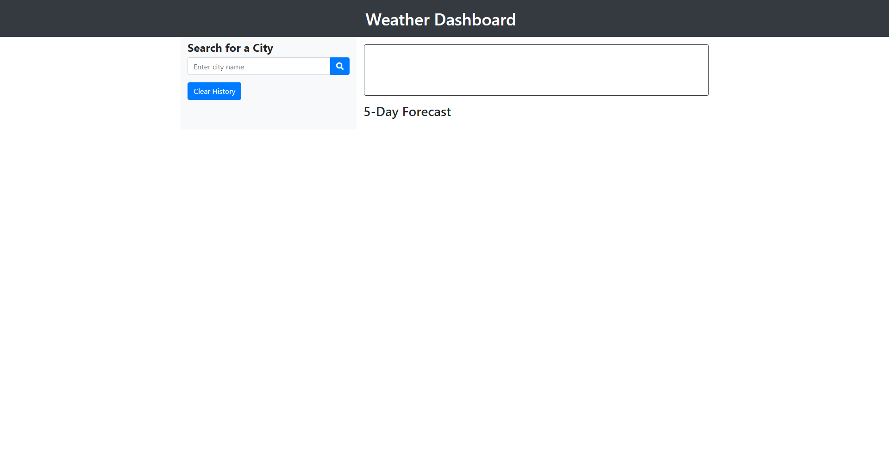
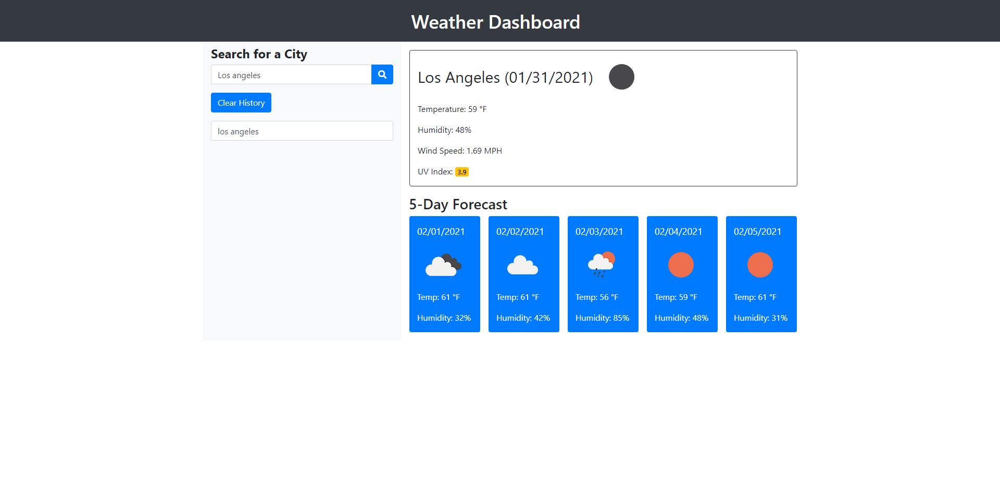

# 06-Weather-Dashboard

## Purpose
A website created to take a city as an input and display the weather today(shows temperature, humidity, wind speed, and uv index) and to show a 5 day forecast(shows basic weather forecast, temperature, and humidity). This also saves past cities searched into local storage. (Link to deployed project is at the bottom)

## Built With
* HTML
* CSS
* JavaScript
* Bootstrap
* moment.js

## Screenshot
* The first screenshot shows the website without any inputs.

* The second screenshot shows when a city is inputted.

## Link to Website
https://jcc83267.github.io/06-Weather-Dashboard/
